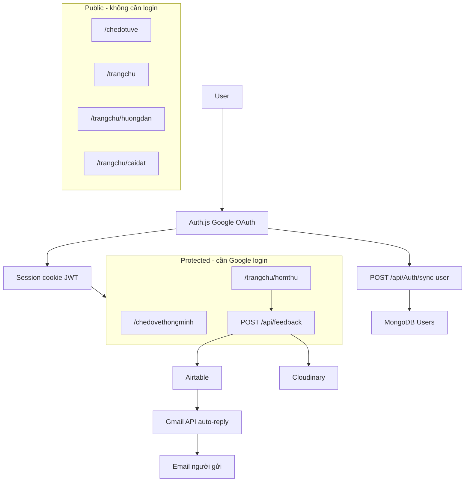
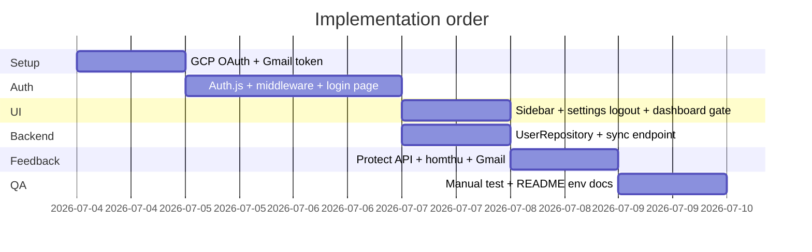

# Plan: Google Login + Gmail xác nhận góp ý

## Phạm vi đã xác nhận

| Hạng mục | Quyết định |
|----------|------------|
| Login | Google OAuth qua **Auth.js v5** (`next-auth@beta`) |
| Session | **JWT trong httpOnly cookie** — đóng tab/mở lại vẫn đăng nhập; logout xóa session |
| Route bắt buộc login | [`/chedovethongminh`](frontend/app/chedovethongminh/page.tsx) (Vẽ thông minh), [`/trangchu/homthu`](frontend/app/trangchu/homthu/page.tsx) (Hòm thư góp ý), `POST /api/feedback` |
| Route công khai | Manual draw (`/chedotuve`), dashboard, hướng dẫn, cài đặt, thông tin chủ sở hữu |
| UI | Avatar + tên/email trên sidebar [`trangchu/layout.tsx`](frontend/app/trangchu/layout.tsx); nút **Đăng xuất** trong [`trangchu/caidat/page.tsx`](frontend/app/trangchu/caidat/page.tsx) |
| Email | **Gmail API** + refresh token — auto-reply xác nhận cho người gửi góp ý |
| Lưu user | Upsert MongoDB qua backend — tận dụng [`User.cs`](backend/Domains/Entities/User.cs) (`google_id`, `email`, `avatar`) |
| Production | [https://vehinhkhongkho.com](https://vehinhkhongkho.com) |

**Ngoài phạm vi giai đoạn này:** bắt buộc login toàn app, bảo vệ backend geometry API, thông báo email cho admin, UI admin inbox.

---

## Kiến trúc



**Hai luồng OAuth Google riêng biệt:**

| Luồng | Mục đích | Scope |
|-------|----------|-------|
| Auth.js Google Provider | User đăng nhập app | `openid`, `email`, `profile` |
| Gmail API (refresh token server-side) | Gửi email xác nhận | `https://www.googleapis.com/auth/gmail.send` |

---

## Phase 0 — Google Cloud Console

1. **OAuth consent screen** (External hoặc Internal)
   - Authorized domain: `vehinhkhongkho.com`
2. **OAuth Client — Web application** (Sign-In)
   - Redirect URIs:
     - Dev: `http://localhost:3000/api/auth/callback/google`
     - Prod: `https://vehinhkhongkho.com/api/auth/callback/google`
   - Lưu `GOOGLE_CLIENT_ID`, `GOOGLE_CLIENT_SECRET`
3. **Bật Gmail API** — lấy refresh token một lần (OAuth Playground hoặc script) với scope `gmail.send`, tài khoản gửi mail (vd `tlnghiajmail@gmail.com`)
   - Lưu `GMAIL_REFRESH_TOKEN`, `GMAIL_SENDER_EMAIL`
4. **Lưu ý:** Gmail cá nhân dùng refresh token, không dùng Service Account.

---

## Phase 1 — Auth.js trên Frontend

### Packages & config

- Cài `next-auth@beta` + `googleapis` (Gmail)
- Tạo [`frontend/auth.ts`](frontend/auth.ts):
  - Google provider
  - `session: { strategy: "jwt", maxAge: 30 * 24 * 60 * 60 }` (30 ngày — cookie bền vững)
  - Callback `signIn` → gọi sync user backend
  - Callback `jwt` / `session` → expose `email`, `name`, `picture`, `googleId`
- Tạo [`frontend/app/api/auth/[...nextauth]/route.ts`](frontend/app/api/auth/[...nextauth]/route.ts)
- Wrap [`frontend/app/layout.tsx`](frontend/app/layout.tsx) bằng `SessionProvider`

### Env vars

```
AUTH_SECRET=                    # openssl rand -base64 32
AUTH_URL=http://localhost:3000  # prod: https://vehinhkhongkho.com
GOOGLE_CLIENT_ID=
GOOGLE_CLIENT_SECRET=
NEXT_PUBLIC_API_URL=            # đã có — dùng cho sync-user
INTERNAL_API_KEY=               # đã có — bảo vệ sync endpoint
```

Cập nhật [`docker-compose.yml`](docker-compose.yml) service `frontend`.

### Middleware — [`frontend/middleware.ts`](frontend/middleware.ts)

Bảo vệ matcher:

- `/chedovethongminh/:path*`
- `/trangchu/homthu/:path*`
- `/api/feedback` (POST only)

Chưa login → redirect `/dang-nhap?callbackUrl=<path>`.

Dùng `auth()` wrapper từ Auth.js v5 (edge-compatible).

### Trang đăng nhập — [`frontend/app/dang-nhap/page.tsx`](frontend/app/dang-nhap/page.tsx)

- Nút "Đăng nhập bằng Google"
- Đọc `callbackUrl` từ query → redirect sau login
- Copy tiếng Việt, khớp UI hiện tại

---

## Phase 2 — Sidebar & Settings UI

### Sidebar — [`frontend/app/trangchu/layout.tsx`](frontend/app/trangchu/layout.tsx)

Thêm block phía trên `NAV_BOTTOM`:

- **Chưa login:** avatar placeholder + "Đăng nhập" → `/dang-nhap`
- **Đã login:** avatar Google + tên + email (truncate)

### Dashboard soft-gate — [`frontend/app/trangchu/page.tsx`](frontend/app/trangchu/page.tsx)

`handleNewAIProject`: nếu chưa có session → `/dang-nhap?callbackUrl=/chedovethongminh` thay vì push trực tiếp.

Tương tự nav "Hòm thư góp ý" có thể giữ middleware hard-gate; optional toast nếu guest click.

### Cài đặt — [`frontend/app/trangchu/caidat/page.tsx`](frontend/app/trangchu/caidat/page.tsx)

Thêm card **Tài khoản**:

- Hiển thị email đang đăng nhập (nếu có)
- Nút **Đăng xuất** → `signOut({ callbackUrl: '/trangchu' })` — xóa session cookie

---

## Phase 3 — Backend MongoDB user sync

Wire infrastructure đã có sẵn stub:

| File mới | Nội dung |
|----------|----------|
| [`backend/Application/Interfaces/IUserRepository.cs`](backend/Application/Interfaces/IUserRepository.cs) | `GetByGoogleIdAsync`, `UpsertGoogleUserAsync` |
| [`backend/Infrastructure/Repositories/UserRepository.cs`](backend/Infrastructure/Repositories/UserRepository.cs) | Mongo upsert theo `google_id` |
| [`backend/WebApi/Controllers/AuthController.cs`](backend/WebApi/Controllers/AuthController.cs) | `POST /api/Auth/sync-user` |

**[`Program.cs`](backend/WebApi/Program.cs):** register `MongoDbContext`, `IUserRepository`.

**Payload sync** (gọi server-side từ Auth.js `signIn` callback):

```json
{ "googleId": "...", "email": "...", "fullName": "...", "avatar": "..." }
```

**Bảo mật:** header `x-api-key: INTERNAL_API_KEY` (pattern đã dùng giữa services).

**Upsert logic:** tìm theo `google_id` → update `email`, `full_name`, `avatar`, `updated_at`; tạo mới nếu chưa có (`role: ["User"]`, không set `password`).

---

## Phase 4 — Hòm thư góp ý + Gmail

### [`homthu/page.tsx`](frontend/app/trangchu/homthu/page.tsx)

- Bỏ input email thủ công
- Hiển thị email đã xác minh từ session
- Success message: *"Chúng tôi đã gửi email xác nhận tới …"*

### [`api/feedback/route.ts`](frontend/app/api/feedback/route.ts)

Thứ tự mới:

1. `auth()` — không session → **401**
2. Lấy `email` từ `session.user.email` (**bỏ qua** email từ form — chống spoof)
3. Cloudinary + Airtable (giữ nguyên)
4. Airtable OK → gọi Gmail send
5. Trả `{ ok: true, emailSent: true|false }` — mail fail không rollback Airtable

**Airtable (optional):** thêm field `GoogleId` hoặc `AuthProvider=Google`.

### Gmail service

- [`frontend/lib/gmail.ts`](frontend/lib/gmail.ts) — server-only, `googleapis`
- [`frontend/lib/email-templates/feedback-confirmation.ts`](frontend/lib/email-templates/feedback-confirmation.ts) — HTML + plain text tiếng Việt

**Env:**

```
GMAIL_SENDER_EMAIL=
GMAIL_REFRESH_TOKEN=
# Có thể tái dùng GOOGLE_CLIENT_ID/SECRET hoặc client riêng
```

**Template gợi ý:** cảm ơn, loại góp ý, số sao, preview nội dung, mã Airtable record (nếu parse được).

---

## Phase 5 — Bảo mật & vận hành

| Mục | Cách xử lý |
|-----|------------|
| Email spoof | Chỉ dùng session email server-side |
| Spam feedback | Rate limit ~3 req/15 phút/user trên `/api/feedback` |
| Session | httpOnly cookie qua Auth.js; `maxAge` 30 ngày |
| Solver API | Giai đoạn 1 chỉ gate FE; backend geometry vẫn public |
| Secrets | Không commit `.env`; cập nhật [`README_en.md`](README_en.md) + `.env.example` |
| CORS backend | Không đổi (geometry API public) |

---

## Phase 6 — Kiểm thử

**Manual:**

1. Guest vào `/chedovethongminh` → redirect login
2. Guest vào `/trangchu/homthu` → redirect login
3. Guest bấm "Dự án AI mới" trên dashboard → redirect login
4. Login Google → quay lại đúng `callbackUrl`
5. Đóng tab, mở lại → vẫn đăng nhập (cookie còn)
6. Gửi góp ý → Airtable + email xác nhận
7. Logout từ Cài đặt → session mất, protected route redirect lại
8. MongoDB `Users` có document sau login
9. `curl POST /api/feedback` không cookie → 401

**E2E:** cập nhật [`frontend/e2e/responsive.spec.ts`](frontend/e2e/responsive.spec.ts) — test redirect khi chưa auth; Google login mock/skip trong CI.

---

## Files chính

**Tạo mới:**

- `frontend/auth.ts`
- `frontend/middleware.ts`
- `frontend/app/api/auth/[...nextauth]/route.ts`
- `frontend/app/dang-nhap/page.tsx`
- `frontend/lib/gmail.ts`
- `frontend/lib/email-templates/feedback-confirmation.ts`
- `backend/Application/Interfaces/IUserRepository.cs`
- `backend/Infrastructure/Repositories/UserRepository.cs`
- `backend/WebApi/Controllers/AuthController.cs`
- `.env.example` (auth + gmail vars)

**Sửa:**

- [`frontend/app/trangchu/layout.tsx`](frontend/app/trangchu/layout.tsx)
- [`frontend/app/trangchu/page.tsx`](frontend/app/trangchu/page.tsx)
- [`frontend/app/trangchu/caidat/page.tsx`](frontend/app/trangchu/caidat/page.tsx)
- [`frontend/app/trangchu/homthu/page.tsx`](frontend/app/trangchu/homthu/page.tsx)
- [`frontend/app/api/feedback/route.ts`](frontend/app/api/feedback/route.ts)
- [`frontend/app/layout.tsx`](frontend/app/layout.tsx)
- [`frontend/package.json`](frontend/package.json)
- [`backend/WebApi/Program.cs`](backend/WebApi/Program.cs)
- [`docker-compose.yml`](docker-compose.yml)
- [`README_en.md`](README_en.md) / [`README_vi.md`](README_vi.md)

---

## Thứ tự triển khai



**Ước lượng:** ~5–7 ngày (1 dev). OAuth consent External ở chế độ Testing: tối đa 100 test users cho đến khi verify app.

---

## Mở rộng tương lai (ghi nhận)

- Bắt buộc login toàn app + JWT trên .NET backend
- Lưu bản vẽ cloud theo `UserId` ([`Problem.cs`](backend/Domains/Entities/Problem.cs))
- Nối "Report wrong" trong solver vào `/api/feedback`
- Thông báo email cho admin khi có góp ý mới
