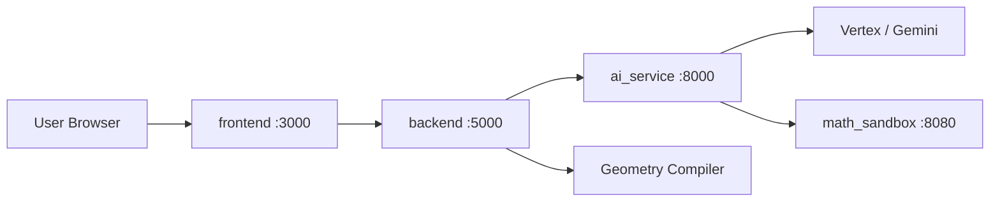

# SpatialGeometry

AI-assisted **3D spatial geometry** platform for Vietnamese education. Users can draw solids manually or submit problem text; the system extracts structured geometry, compiles 3D coordinates, and renders interactive models in the browser.

**Live site:** [https://vehinhkhongkho.com](https://vehinhkhongkho.com)

## Architecture



| Service | Stack | Role |
|---------|-------|------|
| `frontend` | Next.js 16, React 19, Three.js, Tailwind CSS 4 | Dashboard, manual drawing mode, AI solver mode, 3D canvas |
| `backend` | .NET 10 Web API | Geometry compiler: fact/query handlers, validation, coordinate building |
| `ai_service` | FastAPI, Vertex/Gemini | NLP extraction of geometry JSON from problem text; SymPy fallback orchestration |
| `math_sandbox` | FastAPI, SymPy | Sandboxed Python execution for symbolic math |

**Typical flow:** problem text → `ai_service` (LLM → JSON schema) → `backend` (`GeometryCompiler`) → `frontend` (React Three Fiber). If validation fails, the backend requests a SymPy retry via `math_sandbox`.

## Prerequisites

- [Docker](https://www.docker.com/) & Docker Compose (recommended for full stack)
- Or, for local development:
  - Node.js 20+
  - .NET 10 SDK
  - Python 3.10+

## Environment Variables

Create a `.env` file at the repository root (see `docker-compose.yml`):

| Variable | Used by | Description |
|----------|---------|-------------|
| `INTERNAL_API_KEY` | all internal services | Shared API key between services |
| `VERTEX_GEMINI_APIKEY` | ai_service | Google Vertex / Gemini API key |
| `VERTEX_PROJECT_ID` | ai_service | GCP project ID |
| `VERTEX_LOCATION` | ai_service | GCP region |
| `PROD_MONGODB_CONNECTION_STRING` | backend | MongoDB connection string |
| `NEXT_PUBLIC_API_URL` | frontend | Public backend URL (e.g. `http://localhost:5000`) |
| `AUTH_SECRET` | frontend | Auth.js session secret (`openssl rand -base64 32`) |
| `AUTH_URL` | frontend | Public frontend URL (e.g. `http://localhost:3000` or `https://vehinhkhongkho.com`) |
| `GOOGLE_CLIENT_ID` | frontend | Google OAuth Web client ID (Sign-In) |
| `GOOGLE_CLIENT_SECRET` | frontend | Google OAuth Web client secret |
| `GMAIL_SENDER_EMAIL` | frontend | Gmail address used to send feedback confirmations |
| `GMAIL_REFRESH_TOKEN` | frontend | OAuth refresh token with `gmail.send` scope |
| `AIRTABLE_TOKEN_ID` | frontend | Feedback form (Airtable) |
| `AIRTABLE_BASE_ID` | frontend | Airtable base |
| `AIRTABLE_TABLE_NAME` | frontend | Airtable table |
| `CLOUDINARY_NAME` | frontend | Image upload (feedback) |
| `CLOUDINARY_API_KEY` | frontend | Cloudinary API key |
| `CLOUDINARY_SECRET_KEY` | frontend | Cloudinary secret |

Google Sign-In is required for **Smart draw** (`/chedovethongminh`) and **Feedback mailbox** (`/trangchu/homthu`). Other pages stay public. OAuth redirect URIs:

- `http://localhost:3000/api/auth/callback/google`
- `https://vehinhkhongkho.com/api/auth/callback/google`

See `.env.example` for the full list.

## Quick Start (Docker)

```bash
# From repository root
docker compose up --build
```

| Service | URL |
|---------|-----|
| **Production (frontend)** | [https://vehinhkhongkho.com](https://vehinhkhongkho.com) |
| Frontend (local) | http://localhost:3000 |
| Backend API (local) | http://localhost:5000 |
| Backend Swagger (local) | http://localhost:5000/swagger |

## Local Development

### Frontend

```bash
cd frontend
npm install
npm run dev          # http://localhost:3000
npm run test:e2e     # Playwright responsive tests
```

### Backend

```bash
cd backend
dotnet run --project WebApi/WebApi.csproj
```

Smoke tests (env-var gated, run from `WebApi/Program.cs`):

```bash
RUN_BATCH1_SMOKETESTS=1 dotnet run --project WebApi/WebApi.csproj
```

### AI Service

```bash
cd ai_service
python -m venv venv
# Windows: venv\Scripts\activate
pip install -r requirements.txt
uvicorn main:app --reload --port 8000
```

### Math Sandbox

```bash
cd math_sandbox
pip install -r requirements.txt
uvicorn main:app --reload --port 8080
```

## Main Routes (Frontend)

| Path | Description |
|------|-------------|
| `/trangchu` | Dashboard — project list |
| `/chedotuve` | Manual drawing mode (public) |
| `/chedovethongminh` | AI smart solver mode (**requires Google login**) |
| `/trangchu/homthu` | Feedback mailbox (**requires Google login**) |
| `/trangchu/caidat` | Settings (theme + logout) |
| `/trangchu/huongdan` | User guide |
| `/trangchu/thongtin` | About / profile |
| `/dang-nhap` | Google Sign-In page |

## Backend API (high level)

| Endpoint | Description |
|----------|-------------|
| `POST /api/Geometry/process1` | Compile geometry JSON → 3D points |
| `POST /api/Geometry/solve` | Full pipeline: text → extract → compile → optional SymPy retry |
| `POST /api/Auth/sync-user` | Upsert Google user into MongoDB (`x-api-key`) |

## Source Tree

Excludes build artifacts (`node_modules`, `.next`, `venv`, `__pycache__`, `bin`, `obj`, `jsonBin`, `sympyBin`).

```
SpatialGeometry/
├── .env                          # Local secrets (gitignored)
├── .env.example                  # Documented env vars (auth, Gmail, services)
├── .gitignore
├── docker-compose.yml
├── LICENSE
├── README_en.md
├── README_vi.md
│
├── .vscode/
│   ├── launch.json
│   └── tasks.json
│
├── frontend/                       # Next.js web app
│   ├── auth.ts                             # Auth.js (Google OAuth)
│   ├── middleware.ts                       # Protect smart draw + feedback
│   ├── app/
│   │   ├── api/auth/[...nextauth]/route.ts
│   │   ├── api/feedback/route.ts
│   │   ├── dang-nhap/page.tsx              # Google Sign-In
│   │   ├── chedotuve/page.tsx              # Manual drawing mode
│   │   ├── chedovethongminh/page.tsx       # AI solver mode
│   │   ├── trangchu/
│   │   │   ├── caidat/page.tsx             # Settings + logout
│   │   │   ├── homthu/page.tsx             # Feedback
│   │   │   ├── huongdan/page.tsx           # Guide
│   │   │   ├── thongtin/page.tsx           # About
│   │   │   ├── layout.tsx
│   │   │   └── page.tsx                    # Dashboard
│   │   ├── globals.css
│   │   ├── layout.tsx
│   │   └── page.tsx
│   ├── components/
│   │   ├── geometry/
│   │   │   ├── import/ai-to-manual.ts
│   │   │   ├── solve/
│   │   │   │   ├── fixtures/
│   │   │   │   │   ├── case-basic.json
│   │   │   │   │   ├── case-round-solids.json
│   │   │   │   │   └── case-sections.json
│   │   │   │   ├── dev-validate-fixtures.ts
│   │   │   │   ├── solve-left-panel.tsx
│   │   │   │   ├── solve-logic.ts
│   │   │   │   └── solve-processing-overlay.tsx
│   │   │   ├── canvas-3d-r3f.tsx           # React Three Fiber canvas
│   │   │   ├── canvas-toolbar.tsx
│   │   │   ├── dashboard-view.tsx
│   │   │   ├── entity-style-controls.tsx
│   │   │   ├── geometry-context.tsx
│   │   │   ├── geometry-mobile-gate.tsx
│   │   │   ├── geometry-tablet-banner.tsx
│   │   │   ├── manual-canvas-3d.tsx
│   │   │   ├── manual-editor.ts
│   │   │   ├── manual-left-panel.tsx
│   │   │   ├── manual-left-sub-panel.tsx
│   │   │   ├── manual-right-panel.tsx
│   │   │   ├── manual-view.tsx
│   │   │   ├── oxyz-projection.ts
│   │   │   ├── project-transfer.ts
│   │   │   ├── right-sidebar.tsx
│   │   │   ├── solver-view.tsx
│   │   │   └── theme-switcher.tsx
│   │   ├── ui/                             # shadcn/ui (in use)
│   │   │   ├── alert-dialog.tsx
│   │   │   ├── badge.tsx
│   │   │   ├── button.tsx
│   │   │   ├── card.tsx
│   │   │   ├── input.tsx
│   │   │   ├── label.tsx
│   │   │   ├── select.tsx
│   │   │   ├── sheet.tsx
│   │   │   ├── switch.tsx
│   │   │   ├── tabs.tsx
│   │   │   ├── textarea.tsx
│   │   │   └── tooltip.tsx
│   │   └── theme-provider.tsx
│   ├── e2e/responsive.spec.ts
│   ├── hooks/
│   │   ├── use-project-store.ts
│   │   └── use-viewport-tier.ts
│   ├── lib/
│   │   ├── breakpoints.ts
│   │   └── utils.ts
│   ├── public/
│   │   ├── apple-icon.png
│   │   ├── icon.svg
│   │   ├── icon-dark-32x32.png
│   │   └── icon-light-32x32.png
│   ├── Dockerfile
│   ├── components.json
│   ├── next.config.mjs
│   ├── package.json
│   ├── playwright.config.ts
│   ├── postcss.config.mjs
│   └── tsconfig.json
│
├── backend/                        # .NET geometry compiler
│   ├── Application/
│   │   ├── Compilers/
│   │   │   ├── FactHandlers/               # 29 fact handlers
│   │   │   │   ├── AngleBisectorHandler.cs
│   │   │   │   ├── AngleHandler.cs
│   │   │   │   ├── AreaHandler.cs
│   │   │   │   ├── BelongsToHandler.cs
│   │   │   │   ├── CentroidHandler.cs
│   │   │   │   ├── CircumcenterHandler.cs
│   │   │   │   ├── CircumscribedHandler.cs
│   │   │   │   ├── CollinearHandler.cs
│   │   │   │   ├── CoplanarHandler.cs
│   │   │   │   ├── DistanceHandler.cs
│   │   │   │   ├── EqualityHandler.cs
│   │   │   │   ├── IFactHandler.cs
│   │   │   │   ├── IncenterHandler.cs
│   │   │   │   ├── InscribedHandler.cs
│   │   │   │   ├── IntersectionHandler.cs
│   │   │   │   ├── LengthHandler.cs
│   │   │   │   ├── MidpointHandler.cs
│   │   │   │   ├── OppositeRayHandler.cs
│   │   │   │   ├── OrthocenterHandler.cs
│   │   │   │   ├── ParallelHandler.cs
│   │   │   │   ├── PerimeterHandler.cs
│   │   │   │   ├── PerpendicularHandler.cs
│   │   │   │   ├── PerpendicularRayHandler.cs
│   │   │   │   ├── ProjectionHandler.cs
│   │   │   │   ├── RatioHandler.cs
│   │   │   │   ├── RayHandler.cs
│   │   │   │   ├── ShapeHandler.cs
│   │   │   │   ├── TangentHandler.cs
│   │   │   │   └── VolumeHandler.cs
│   │   │   ├── FactValidators/             # 25 validators
│   │   │   │   ├── AngleValidator.cs
│   │   │   │   ├── AreaValidator.cs
│   │   │   │   ├── BelongsToValidator.cs
│   │   │   │   ├── CentroidValidator.cs
│   │   │   │   ├── CircumcenterValidator.cs
│   │   │   │   ├── CircumscribedValidator.cs
│   │   │   │   ├── CollinearValidator.cs
│   │   │   │   ├── CoplanarValidator.cs
│   │   │   │   ├── DistanceValidator.cs
│   │   │   │   ├── EqualityValidator.cs
│   │   │   │   ├── FactGeometryHelper.cs
│   │   │   │   ├── FactValidationEngine.cs
│   │   │   │   ├── IFactValidator.cs
│   │   │   │   ├── IncenterValidator.cs
│   │   │   │   ├── InscribedValidator.cs
│   │   │   │   ├── LengthValidator.cs
│   │   │   │   ├── MidpointValidator.cs
│   │   │   │   ├── OrthocenterValidator.cs
│   │   │   │   ├── ParallelValidator.cs
│   │   │   │   ├── PerimeterValidator.cs
│   │   │   │   ├── PerpendicularValidator.cs
│   │   │   │   ├── ProjectionValidator.cs
│   │   │   │   ├── RatioValidator.cs
│   │   │   │   ├── ShapeValidator.cs
│   │   │   │   ├── TangentValidator.cs
│   │   │   │   ├── ValidationResult.cs
│   │   │   │   └── VolumeValidator.cs
│   │   │   ├── Helpers/TopologyHelper.cs
│   │   │   ├── QueryHandlers/
│   │   │   │   ├── Batch5QueryHandlers.cs
│   │   │   │   └── IQueryHandler.cs
│   │   │   ├── QueryValidators/
│   │   │   │   ├── Batch5QueryValidators.cs
│   │   │   │   ├── IQueryValidator.cs
│   │   │   │   └── QueryGeometryHelper.cs
│   │   │   ├── CompilationContext.cs
│   │   │   ├── EntityScaffoldBuilder.cs
│   │   │   ├── GeometryCompiler.cs
│   │   │   ├── IGeometryCompiler.cs
│   │   │   ├── PointIntegrityHelper.cs
│   │   │   ├── QueryProcessingEngine.cs
│   │   │   ├── ShapeBuildHelper.cs
│   │   │   └── TriangleBuildHelper.cs
│   │   ├── DTOs/
│   │   │   ├── Enums/                      # AngleType, FactType, QueryType, …
│   │   │   ├── Facts/                      # Per-fact data models
│   │   │   ├── Queries/                    # Per-query data models
│   │   │   ├── EntitiesDto.cs
│   │   │   ├── ExtractionMetaDto.cs
│   │   │   ├── FactDto.cs
│   │   │   ├── GeometryProblemDto.cs
│   │   │   ├── MathSolverRequestDto.cs
│   │   │   ├── MathSolverResponseDto.cs
│   │   │   ├── MetadataDto.cs
│   │   │   ├── QueryDto.cs
│   │   │   ├── SectionDataDto.cs
│   │   │   └── ShapeTargetData.cs
│   │   ├── Interfaces/
│   │   │   ├── IGeometryExtractionService.cs
│   │   │   └── IProblemRepository.cs
│   │   └── Application.csproj
│   ├── Domains/
│   │   ├── Entities/                       # MongoDB entity stubs
│   │   │   ├── PointResult.cs
│   │   │   ├── Problem.cs
│   │   │   ├── Shape.cs
│   │   │   └── User.cs
│   │   ├── MathCore/                       # 3D math primitives
│   │   │   ├── Line3D.cs
│   │   │   ├── Plane3D.cs
│   │   │   ├── Point3D.cs
│   │   │   ├── Sphere3D.cs
│   │   │   └── Vector3D.cs
│   │   └── Domains.csproj
│   ├── Infrastructure/
│   │   ├── Data/MongoDbContext.cs
│   │   ├── ExternalAPIs/GeometryExtractionService.cs
│   │   └── Infrastructure.csproj
│   ├── WebApi/
│   │   ├── Controllers/GeometryController.cs
│   │   ├── Diagnostics/                    # Batch 1–6 smoke tests
│   │   │   ├── Batch1SmokeTests.cs
│   │   │   ├── Batch2SmokeTests.cs
│   │   │   ├── Batch3SmokeTests.cs
│   │   │   ├── Batch4SmokeTests.cs
│   │   │   ├── Batch5SmokeTests.cs
│   │   │   └── Batch6SmokeTests.cs
│   │   ├── appsettings.json
│   │   ├── Program.cs
│   │   └── WebApi.csproj
│   ├── Dockerfile
│   └── SpatialGeometry.sln
│
├── ai_service/                     # FastAPI LLM extraction service
│   ├── api/
│   │   ├── llm_client.py
│   │   ├── llm_config.py
│   │   ├── llm_provider.py
│   │   └── sympy_engine.py
│   ├── prompts/
│   │   ├── few_shots.json
│   │   ├── prompt_builder.py
│   │   ├── sympy_prompt.txt
│   │   └── user_template.txt
│   ├── schemas/
│   │   ├── enums/
│   │   │   ├── angle_types.json
│   │   │   ├── fact_types.json
│   │   │   ├── geometry_objects.json
│   │   │   ├── intersection_types.json
│   │   │   ├── query_types.json
│   │   │   └── shape_types.json
│   │   ├── rules/
│   │   │   ├── entity_inference_rules.json
│   │   │   ├── expression_rules.json
│   │   │   └── semantic_rules.json
│   │   ├── geometry_schema.json
│   │   └── JSON_templete.json
│   ├── utils/
│   │   ├── retry_engine.py
│   │   └── validator.py
│   ├── Dockerfile
│   ├── main.py
│   ├── requirements.txt
│   └── route.py
│
└── math_sandbox/                   # SymPy execution sandbox
    ├── Dockerfile
    ├── main.py
    ├── requirements.txt
    └── test_sympy.py
```

## License

Source code is published under a **source-available** model (see [`LICENSE`](LICENSE)):

| Allowed | Not allowed |
|---------|-------------|
| Read/view code for learning, research, transparency | Fork, mirror, or redistribute the code |
| Use the official service at [vehinhkhongkho.com](https://vehinhkhongkho.com) | Create derivative works |
| Report issues or feedback (without redistributing code) | Commercial use or competing services based on this code |

Commercial rights are reserved by **TRAN LAM NGHIA**. Third-party libraries remain under their own licenses.
