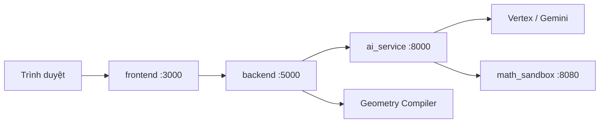

# SpatialGeometry

Nền tảng **hình học không gian 3D** hỗ trợ AI, hướng tới giáo dục Việt Nam. Người dùng có thể tự vẽ khối hình thủ công hoặc nhập đề bài; hệ thống trích xuất cấu trúc hình học, biên dịch tọa độ 3D và hiển thị mô hình tương tác trên trình duyệt.

**Website:** [https://vehinhkhongkho.com](https://vehinhkhongkho.com)

## Kiến trúc



| Service | Công nghệ | Vai trò |
|---------|-----------|---------|
| `frontend` | Next.js 16, React 19, Three.js, Tailwind CSS 4 | Dashboard, chế độ vẽ tay, chế độ giải thông minh, canvas 3D |
| `backend` | .NET 10 Web API | Geometry compiler: xử lý fact/query, kiểm chứng, dựng tọa độ |
| `ai_service` | FastAPI, Vertex/Gemini | Trích xuất JSON hình học từ đề bài; điều phối fallback SymPy |
| `math_sandbox` | FastAPI, SymPy | Chạy Python/SymPy trong sandbox an toàn |

**Luồng điển hình:** đề bài → `ai_service` (LLM → JSON schema) → `backend` (`GeometryCompiler`) → `frontend` (React Three Fiber). Nếu kiểm chứng thất bại, backend gọi SymPy qua `math_sandbox` để thử lại.

## Yêu cầu hệ thống

- [Docker](https://www.docker.com/) & Docker Compose (khuyến nghị cho full stack)
- Hoặc phát triển local:
  - Node.js 20+
  - .NET 10 SDK
  - Python 3.10+

## Biến môi trường

Tạo file `.env` tại thư mục gốc repo (tham chiếu `docker-compose.yml`):

| Biến | Service | Mô tả |
|------|---------|-------|
| `INTERNAL_API_KEY` | tất cả service nội bộ | API key dùng chung giữa các service |
| `VERTEX_GEMINI_APIKEY` | ai_service | API key Google Vertex / Gemini |
| `VERTEX_PROJECT_ID` | ai_service | GCP project ID |
| `VERTEX_LOCATION` | ai_service | Vùng GCP |
| `PROD_MONGODB_CONNECTION_STRING` | backend | Chuỗi kết nối MongoDB |
| `NEXT_PUBLIC_API_URL` | frontend | URL backend public (vd. `http://localhost:5000`) |
| `JWT_SECRET` | backend | Secret HMAC cho access token backend |
| `JWT_ISSUER` / `JWT_AUDIENCE` | backend | Issuer/audience JWT (mặc định `SpatialGeometry`) |
| `AUTH_SECRET` | frontend | Secret session Auth.js (`openssl rand -base64 32`) |
| `AUTH_URL` | frontend | URL frontend công khai (vd `http://localhost:3000` hoặc `https://vehinhkhongkho.com`) |
| `GOOGLE_CLIENT_ID` | frontend | Google OAuth Web client ID (đăng nhập) |
| `GOOGLE_CLIENT_SECRET` | frontend | Google OAuth Web client secret |
| `SMTP_HOST` / `SMTP_PORT` / `SMTP_USER` / `SMTP_PASS` | backend + frontend | SMTP gửi OTP đăng ký và email góp ý |
| `MAIL_FROM` / `MAIL_FROM_NAME` | backend + frontend | Địa chỉ From cho mail hệ thống |
| `AIRTABLE_TOKEN_ID` | frontend | Form phản hồi (Airtable) |
| `AIRTABLE_BASE_ID` | frontend | Airtable base |
| `AIRTABLE_TABLE_NAME` | frontend | Bảng Airtable |
| `CLOUDINARY_NAME` | frontend | Upload ảnh phản hồi |
| `CLOUDINARY_API_KEY` | frontend | Cloudinary API key |
| `CLOUDINARY_SECRET_KEY` | frontend | Cloudinary secret |

Đăng nhập Google **hoặc email/mật khẩu (đã xác minh OTP)** bắt buộc cho **Vẽ thông minh** (`/chedovethongminh`) và **Hòm thư góp ý** (`/trangchu/homthu`). Các trang khác vẫn dùng được khi chưa đăng nhập. Redirect URI OAuth:

- `http://localhost:3000/api/auth/callback/google`
- `https://vehinhkhongkho.com/api/auth/callback/google`

Xem `.env.example` để biết danh sách đầy đủ.

## Chạy nhanh (Docker)

```bash
# Từ thư mục gốc repo
docker compose up --build
```

| Service | URL |
|---------|-----|
| **Production (frontend)** | [https://vehinhkhongkho.com](https://vehinhkhongkho.com) |
| Frontend (local) | http://localhost:3000 |
| Backend API (local) | http://localhost:5000 |
| Swagger (local) | http://localhost:5000/swagger |

## Phát triển local

### Frontend

```bash
cd frontend
npm install
npm run dev          # http://localhost:3000
npm run test:e2e     # Playwright — test responsive
```

### Backend

```bash
cd backend
dotnet run --project WebApi/WebApi.csproj
```

Smoke test (bật bằng biến môi trường, chạy từ `WebApi/Program.cs`):

```bash
RUN_BATCH1_SMOKETESTS=1 dotnet run --project WebApi/WebApi.csproj
```

### AI Service

```bash
cd ai_service
python -m venv venv
# Windows: venv\Scripts\activate
pip install -r requirements.txt
uvicorn main:app --reload --port 8000
```

### Math Sandbox

```bash
cd math_sandbox
pip install -r requirements.txt
uvicorn main:app --reload --port 8080
```

## Route chính (Frontend)

| Đường dẫn | Mô tả |
|-----------|-------|
| `/trangchu` | Dashboard — danh sách dự án |
| `/chedotuve` | Chế độ vẽ tay (công khai) |
| `/chedovethongminh` | Chế độ giải thông minh AI (**cần đăng nhập Google**) |
| `/trangchu/homthu` | Hòm thư phản hồi (**cần đăng nhập Google**) |
| `/trangchu/caidat` | Cài đặt (giao diện + đăng xuất) |
| `/trangchu/huongdan` | Hướng dẫn sử dụng |
| `/trangchu/thongtin` | Thông tin / giới thiệu |
| `/dangnhap` | Trang đăng nhập (email/mật khẩu + Google) |
| `/dang-ky` | Đăng ký email + xác minh OTP |

## API Backend (tóm tắt)

| Endpoint | Mô tả |
|----------|-------|
| `POST /api/Geometry/process1` | Biên dịch JSON hình học → tọa độ 3D |
| `POST /api/Geometry/solve` | Pipeline đầy đủ: text → trích xuất → biên dịch → SymPy retry (nếu cần) |
| `POST /api/Auth/register` | Bắt đầu đăng ký email; gửi OTP |
| `POST /api/Auth/verify-otp` | Xác minh OTP; cấp JWT backend |
| `POST /api/Auth/login` | Đăng nhập email/mật khẩu; cấp JWT |
| `POST /api/Auth/google-exchange` | Upsert/link user Google + JWT (`x-api-key`) |
| `POST /api/Auth/sync-user` | Alias cũ của google-exchange |

## Source Tree

Loại trừ artifact build (`node_modules`, `.next`, `venv`, `__pycache__`, `bin`, `obj`, `jsonBin`, `sympyBin`).

```
SpatialGeometry/
├── .env                          # Secrets local (gitignored)
├── .env.example                  # Danh sách biến môi trường (auth, Gmail, services)
├── .gitignore
├── docker-compose.yml
├── LICENSE
├── README_en.md
├── README_vi.md
│
├── .vscode/
│   ├── launch.json
│   └── tasks.json
│
├── frontend/                       # Ứng dụng web Next.js
│   ├── auth.ts                             # Auth.js (Google OAuth)
│   ├── middleware.ts                       # Bảo vệ vẽ thông minh + góp ý
│   ├── app/
│   │   ├── api/auth/[...nextauth]/route.ts
│   │   ├── api/feedback/route.ts
│   │   ├── dangnhap/page.tsx              # Đăng nhập Google
│   │   ├── chedotuve/page.tsx              # Chế độ vẽ tay
│   │   ├── chedovethongminh/page.tsx       # Chế độ giải thông minh
│   │   ├── trangchu/
│   │   │   ├── caidat/page.tsx             # Cài đặt + đăng xuất
│   │   │   ├── homthu/page.tsx             # Phản hồi
│   │   │   ├── huongdan/page.tsx           # Hướng dẫn
│   │   │   ├── thongtin/page.tsx           # Giới thiệu
│   │   │   ├── layout.tsx
│   │   │   └── page.tsx                    # Dashboard
│   │   ├── globals.css
│   │   ├── layout.tsx
│   │   └── page.tsx
│   ├── components/
│   │   ├── geometry/
│   │   │   ├── import/ai-to-manual.ts
│   │   │   ├── solve/
│   │   │   │   ├── fixtures/
│   │   │   │   │   ├── case-basic.json
│   │   │   │   │   ├── case-round-solids.json
│   │   │   │   │   └── case-sections.json
│   │   │   │   ├── dev-validate-fixtures.ts
│   │   │   │   ├── solve-left-panel.tsx
│   │   │   │   ├── solve-logic.ts
│   │   │   │   └── solve-processing-overlay.tsx
│   │   │   ├── canvas-3d-r3f.tsx           # Canvas React Three Fiber
│   │   │   ├── canvas-toolbar.tsx
│   │   │   ├── dashboard-view.tsx
│   │   │   ├── entity-style-controls.tsx
│   │   │   ├── geometry-context.tsx
│   │   │   ├── geometry-mobile-gate.tsx
│   │   │   ├── geometry-tablet-banner.tsx
│   │   │   ├── manual-canvas-3d.tsx
│   │   │   ├── manual-editor.ts
│   │   │   ├── manual-left-panel.tsx
│   │   │   ├── manual-left-sub-panel.tsx
│   │   │   ├── manual-right-panel.tsx
│   │   │   ├── manual-view.tsx
│   │   │   ├── oxyz-projection.ts
│   │   │   ├── project-transfer.ts
│   │   │   ├── right-sidebar.tsx
│   │   │   ├── solver-view.tsx
│   │   │   └── theme-switcher.tsx
│   │   ├── ui/                             # shadcn/ui (đang dùng)
│   │   │   ├── alert-dialog.tsx
│   │   │   ├── badge.tsx
│   │   │   ├── button.tsx
│   │   │   ├── card.tsx
│   │   │   ├── input.tsx
│   │   │   ├── label.tsx
│   │   │   ├── select.tsx
│   │   │   ├── sheet.tsx
│   │   │   ├── switch.tsx
│   │   │   ├── tabs.tsx
│   │   │   ├── textarea.tsx
│   │   │   └── tooltip.tsx
│   │   └── theme-provider.tsx
│   ├── e2e/responsive.spec.ts
│   ├── hooks/
│   │   ├── use-project-store.ts
│   │   └── use-viewport-tier.ts
│   ├── lib/
│   │   ├── breakpoints.ts
│   │   └── utils.ts
│   ├── public/
│   │   ├── apple-icon.png
│   │   ├── icon.svg
│   │   ├── icon-dark-32x32.png
│   │   └── icon-light-32x32.png
│   ├── Dockerfile
│   ├── components.json
│   ├── next.config.mjs
│   ├── package.json
│   ├── playwright.config.ts
│   ├── postcss.config.mjs
│   └── tsconfig.json
│
├── backend/                        # Geometry compiler .NET
│   ├── Application/
│   │   ├── Compilers/
│   │   │   ├── FactHandlers/               # 29 fact handlers
│   │   │   │   ├── AngleBisectorHandler.cs
│   │   │   │   ├── AngleHandler.cs
│   │   │   │   ├── AreaHandler.cs
│   │   │   │   ├── BelongsToHandler.cs
│   │   │   │   ├── CentroidHandler.cs
│   │   │   │   ├── CircumcenterHandler.cs
│   │   │   │   ├── CircumscribedHandler.cs
│   │   │   │   ├── CollinearHandler.cs
│   │   │   │   ├── CoplanarHandler.cs
│   │   │   │   ├── DistanceHandler.cs
│   │   │   │   ├── EqualityHandler.cs
│   │   │   │   ├── IFactHandler.cs
│   │   │   │   ├── IncenterHandler.cs
│   │   │   │   ├── InscribedHandler.cs
│   │   │   │   ├── IntersectionHandler.cs
│   │   │   │   ├── LengthHandler.cs
│   │   │   │   ├── MidpointHandler.cs
│   │   │   │   ├── OppositeRayHandler.cs
│   │   │   │   ├── OrthocenterHandler.cs
│   │   │   │   ├── ParallelHandler.cs
│   │   │   │   ├── PerimeterHandler.cs
│   │   │   │   ├── PerpendicularHandler.cs
│   │   │   │   ├── PerpendicularRayHandler.cs
│   │   │   │   ├── ProjectionHandler.cs
│   │   │   │   ├── RatioHandler.cs
│   │   │   │   ├── RayHandler.cs
│   │   │   │   ├── ShapeHandler.cs
│   │   │   │   ├── TangentHandler.cs
│   │   │   │   └── VolumeHandler.cs
│   │   │   ├── FactValidators/             # 25 validators
│   │   │   │   ├── AngleValidator.cs
│   │   │   │   ├── AreaValidator.cs
│   │   │   │   ├── BelongsToValidator.cs
│   │   │   │   ├── CentroidValidator.cs
│   │   │   │   ├── CircumcenterValidator.cs
│   │   │   │   ├── CircumscribedValidator.cs
│   │   │   │   ├── CollinearValidator.cs
│   │   │   │   ├── CoplanarValidator.cs
│   │   │   │   ├── DistanceValidator.cs
│   │   │   │   ├── EqualityValidator.cs
│   │   │   │   ├── FactGeometryHelper.cs
│   │   │   │   ├── FactValidationEngine.cs
│   │   │   │   ├── IFactValidator.cs
│   │   │   │   ├── IncenterValidator.cs
│   │   │   │   ├── InscribedValidator.cs
│   │   │   │   ├── LengthValidator.cs
│   │   │   │   ├── MidpointValidator.cs
│   │   │   │   ├── OrthocenterValidator.cs
│   │   │   │   ├── ParallelValidator.cs
│   │   │   │   ├── PerimeterValidator.cs
│   │   │   │   ├── PerpendicularValidator.cs
│   │   │   │   ├── ProjectionValidator.cs
│   │   │   │   ├── RatioValidator.cs
│   │   │   │   ├── ShapeValidator.cs
│   │   │   │   ├── TangentValidator.cs
│   │   │   │   ├── ValidationResult.cs
│   │   │   │   └── VolumeValidator.cs
│   │   │   ├── Helpers/TopologyHelper.cs
│   │   │   ├── QueryHandlers/
│   │   │   │   ├── Batch5QueryHandlers.cs
│   │   │   │   └── IQueryHandler.cs
│   │   │   ├── QueryValidators/
│   │   │   │   ├── Batch5QueryValidators.cs
│   │   │   │   ├── IQueryValidator.cs
│   │   │   │   └── QueryGeometryHelper.cs
│   │   │   ├── CompilationContext.cs
│   │   │   ├── EntityScaffoldBuilder.cs
│   │   │   ├── GeometryCompiler.cs
│   │   │   ├── IGeometryCompiler.cs
│   │   │   ├── PointIntegrityHelper.cs
│   │   │   ├── QueryProcessingEngine.cs
│   │   │   ├── ShapeBuildHelper.cs
│   │   │   └── TriangleBuildHelper.cs
│   │   ├── DTOs/
│   │   │   ├── Enums/                      # AngleType, FactType, QueryType, …
│   │   │   ├── Facts/                      # Model dữ liệu theo từng fact
│   │   │   ├── Queries/                    # Model dữ liệu theo từng query
│   │   │   ├── EntitiesDto.cs
│   │   │   ├── ExtractionMetaDto.cs
│   │   │   ├── FactDto.cs
│   │   │   ├── GeometryProblemDto.cs
│   │   │   ├── MathSolverRequestDto.cs
│   │   │   ├── MathSolverResponseDto.cs
│   │   │   ├── MetadataDto.cs
│   │   │   ├── QueryDto.cs
│   │   │   ├── SectionDataDto.cs
│   │   │   └── ShapeTargetData.cs
│   │   ├── Interfaces/
│   │   │   ├── IGeometryExtractionService.cs
│   │   │   └── IProblemRepository.cs
│   │   └── Application.csproj
│   ├── Domains/
│   │   ├── Entities/                       # Entity MongoDB (stub)
│   │   │   ├── PointResult.cs
│   │   │   ├── Problem.cs
│   │   │   ├── Shape.cs
│   │   │   └── User.cs
│   │   ├── MathCore/                       # Primitives toán 3D
│   │   │   ├── Line3D.cs
│   │   │   ├── Plane3D.cs
│   │   │   ├── Point3D.cs
│   │   │   ├── Sphere3D.cs
│   │   │   └── Vector3D.cs
│   │   └── Domains.csproj
│   ├── Infrastructure/
│   │   ├── Data/MongoDbContext.cs
│   │   ├── ExternalAPIs/GeometryExtractionService.cs
│   │   └── Infrastructure.csproj
│   ├── WebApi/
│   │   ├── Controllers/GeometryController.cs
│   │   ├── Diagnostics/                    # Smoke test Batch 1–6
│   │   │   ├── Batch1SmokeTests.cs
│   │   │   ├── Batch2SmokeTests.cs
│   │   │   ├── Batch3SmokeTests.cs
│   │   │   ├── Batch4SmokeTests.cs
│   │   │   ├── Batch5SmokeTests.cs
│   │   │   └── Batch6SmokeTests.cs
│   │   ├── appsettings.json
│   │   ├── Program.cs
│   │   └── WebApi.csproj
│   ├── Dockerfile
│   └── SpatialGeometry.sln
│
├── ai_service/                     # FastAPI — trích xuất LLM
│   ├── api/
│   │   ├── llm_client.py
│   │   ├── llm_config.py
│   │   ├── llm_provider.py
│   │   └── sympy_engine.py
│   ├── prompts/
│   │   ├── few_shots.json
│   │   ├── prompt_builder.py
│   │   ├── sympy_prompt.txt
│   │   └── user_template.txt
│   ├── schemas/
│   │   ├── enums/
│   │   │   ├── angle_types.json
│   │   │   ├── fact_types.json
│   │   │   ├── geometry_objects.json
│   │   │   ├── intersection_types.json
│   │   │   ├── query_types.json
│   │   │   └── shape_types.json
│   │   ├── rules/
│   │   │   ├── entity_inference_rules.json
│   │   │   ├── expression_rules.json
│   │   │   └── semantic_rules.json
│   │   ├── geometry_schema.json
│   │   └── JSON_templete.json
│   ├── utils/
│   │   ├── retry_engine.py
│   │   └── validator.py
│   ├── Dockerfile
│   ├── main.py
│   ├── requirements.txt
│   └── route.py
│
└── math_sandbox/                   # Sandbox chạy SymPy
    ├── Dockerfile
    ├── main.py
    ├── requirements.txt
    └── test_sympy.py
```

## Giấy phép

Mã nguồn được công bố theo mô hình **source-available** (xem file [`LICENSE`](LICENSE)):

| Được phép | Không được phép |
|-----------|-----------------|
| Đọc/xem mã để học tập, nghiên cứu, minh bạch | Fork, mirror, phân phối lại mã |
| Dùng dịch vụ chính thức tại [vehinhkhongkho.com](https://vehinhkhongkho.com) | Tạo sản phẩm phái sinh (derivative works) |
| Báo lỗi / góp ý (không kèm sao chép mã) | Dùng mã cho mục đích thương mại hoặc dịch vụ cạnh tranh |

Quyền khai thác thương mại thuộc về **TRẦN LÂM NGHĨA**. Thư viện bên thứ ba trong repo vẫn tuân theo giấy phép riêng của từng gói.